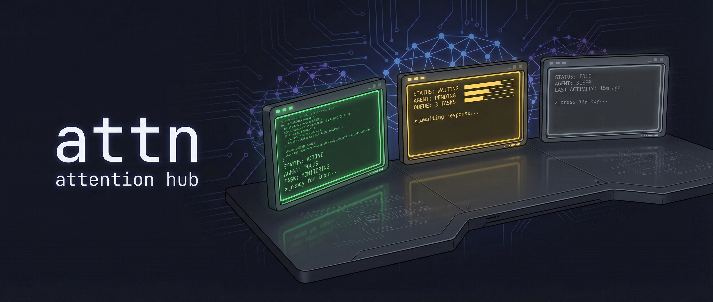

<p align="center">  </p>

# attn

**attention hub**, because your head shouldn't feel like concrete by 3pm.

I built attn after noticing a pattern: I'd start the day sharp, spin up 4-5 AI
agents across different repos, and by mid-afternoon my brain was soup. Not from
the coding, from the _managing_. Which terminal has the agent that's stuck? Did
that one finish? Wait, who asked me a question 20 minutes ago? Alt-tab, alt-tab,
alt-tab, scroll, squint, repeat.

attn stands for Attention. It's an interface that is friendly to both human and
agent brains, built as a harness augmenter. What it does today:

- **Durability.** Restart the attn app, its daemon, even your computer. Open
  attn again and your agents and terminals are still there, waiting for you.
- **Bring your own harness.** attn runs Claude Code, Codex, Copilot, Pi, and
  other CLI agents. You get their native experience, but better. A big lab ships
  a fancy new feature? You get it immediately, as they designed it. Tired of
  attn? Just use the harness in the terminal.
- **The queue mode.** A (currently non-default) mode for running many agents at
  once with lower cognitive overload. Agents are either "waiting for you" or
  "busy"; after every prompt attn moves you to the next one that needs you, so
  you don't waste cycles picking. Simple, very powerful. Trust me, you want to
  try it.
- **Local and remote agents.** Point attn at any host you can SSH into and it
  sets itself up there. A VM, a VPS, an old desktop you installed Linux on so
  agents don't delete your home folder.
- **The Garden.** attn's own task tracking. Work items are seeds you plant,
  agents tend them, and they get harvested. Like beads, but inside attn.
- **Visible orchestration.** Agents delegate to other full-blown agents (not
  subagents) that you can inspect and steer, from any harness to any harness.
  Plan with Fable in Claude Code, implement with GLM 5.3 in Pi, review in Codex
  with Sol. Agents can even message each other and arrange a party.
- **Crew members.** Custom permanent agents, each with its own charter. There's
  also the Chief that keeps track of your agents and helps you delegate, the
  executive assistant for your neurospicy brain.
- **Automations.** Start a steerable agent on a schedule or on an event (a
  review request on a PR, say) and get back a ready review guide + assessment.
- **Annotate anything, send it to the agent.** Opt/alt-select text in a live
  terminal, or in a markdown file attn renders natively (Cmd+click a `.md` path,
  or have the agent run `attn open plan.md`), leave your comments, and send the
  whole batch to the agent as one message.

There are more features, but those are the ones I use every day and am proud about.

For now the attn app is mac only. The daemon also runs on Linux. Full Linux
support is in our plans. Soon!

## The app

**Color-coded status.** Every session in one window; the one that needs you
glows. Green = working. Yellow = "hey, I need you." Gray = done.

**Workspaces in one sidebar.** The sidebar groups your work into workspaces,
each holding the sessions and terminals for one task. Drag to reorder, drag a
session out into its own workspace, rename anything inline.

**Grid view.** Hit Cmd+G to see every session as a live terminal tile at once;
the ones waiting on you flash. Click a tile to zoom in and type straight into
it. Pick the layout, drop tiles you don't care about; it sticks across restarts.

**Panes, splits, and first-class shells.** A workspace can hold several sessions
side by side. Split a pane, open a plain shell as its own session from the same
dialog you use for agents, and move focus between panes with the keyboard.

**A terminal that does more.** Cmd+F finds across the full scrollback. Cmd-click
a path or URL to open it. When your shell marks commands (fish does by default),
click a command's output to grab the whole block: copy the command with its
output in one go, or filter a long block down to just the lines you want.

**Remote daemons over SSH.** Keep sessions on a GPU box, Linux host, or local VM
and manage them from the same app. Spawn new sessions remotely, browse remote
repos, and open remote worktrees without juggling another terminal window.

**PR dashboard.** Your PRs, your review requests, CI failures, merge conflicts,
one place. Works across GitHub.com and GitHub Enterprise. Open a PR directly
into a worktree.

**Git worktrees & branches.** Parallel agents need parallel branches. Spin them
up from the app.

## Supported agents

| Agent | State detection | Resume |
|---|---|---|
| [Claude Code](https://claude.ai/code) | Hooks + classifier + terminal title | Yes |
| [Codex](https://developers.openai.com/codex) | Hooks + classifier + terminal title | Yes |
| [Copilot CLI](https://docs.github.com/en/copilot/using-github-copilot/using-github-copilot-in-the-command-line) | PTY heuristics + transcript classifier | Yes |
| [Pi](https://github.com/badlogic/pi-mono) | attn plugin | Yes |

## Install

### Homebrew cask (desktop app)

```bash
brew tap victorarias/attn https://github.com/victorarias/attn
brew install --cask victorarias/attn/attn
```

This installs `attn.app` with its bundled daemon/runtime binary.

### Direct DMG

Grab the [latest release](https://github.com/victorarias/attn/releases/latest),
open the DMG, drag to Applications.

### Updating

```bash
brew update && brew upgrade --cask victorarias/attn/attn
```

The app nudges you when a new release exists.

## Prerequisites

- macOS (Apple Silicon)
- At least one agent CLI installed
- [GitHub CLI](https://cli.github.com/) (`gh`) v2.81.0+ for PR features

## Quick start

1. Launch **attn** from Applications.
2. **Cmd+T** starts a workspace: pick an
agent (or a plain shell), pick a directory, go. **Cmd+N** adds another session
to the workspace you're in.
3. Watch the sidebar. Colors tell you who needs you.
4. Too many concurrent agents? Enable queue mode!
5. Press **Cmd+/** any time for the full shortcuts list.
6. Optional: add an SSH endpoint in Settings and run remote or VM sessions from
   the same picker.

## Session states

| Color | What it means |
|---|---|
| 🟢 Green | Agent is working. Leave it alone |
| 🟡 Yellow | Agent needs you: asked a question, or finished a long run (5+ min) and is waiting for your review |
| 🟡 Flashing | Agent wants tool approval. Go approve |
| 🔵 Blue (slow pulse) | Parked on a `/loop` or schedule. It'll resume itself |
| 🟣 Purple | State couldn't be read reliably. Worth a glance |
| ⚪ Gray | Done, or a plain shell. Move on |

## Shortcuts

| Shortcut | What it does |
|---|---|
| Cmd+T | New workspace (with an initial session) |
| Cmd+N | New session in current workspace |
| Cmd+Shift+N | New session, split sideways |
| Cmd+D / Cmd+Shift+D | Split pane down / sideways |
| Cmd+Option+←↑→↓ | Move between panes (cross into the next workspace at an edge) |
| Cmd+1–9 | Jump to a workspace |
| Cmd+Up / Down | Jump between sessions |
| Cmd+G | Grid view |
| Cmd+F | Find in terminal |
| Cmd+K | Action menu |
| Cmd+Shift+P | Attention drawer (who needs me?) |
| Cmd+\` | Utility terminal |
| Cmd+R | Refresh PRs |
| Cmd+/ | All keyboard shortcuts |

Every binding is customizable. Press **Cmd+/** in the app for the full,
always-current list, and "Edit shortcuts" there to remap any of them.

### Selecting text in agent terminals

Agents like Claude Code enable terminal mouse tracking, which means a normal
click-drag is forwarded to the agent instead of creating a selection. **Hold
Option while dragging** to bypass mouse tracking and make a selection you can
copy, the same convention iTerm2, Terminal.app, and kitty use.

If the agent explicitly copies text for you (e.g. "copy this to my clipboard"),
attn honors the terminal's OSC 52 clipboard sequence and writes to your Mac
clipboard directly. No xclip / X server needed on the remote.

## Working with many agents

Your agents can work as a team:

- **Delegation.** An agent spins up a fresh, visible session with a focused
  brief (`attn delegate`). You can open that session, talk to the agent, and
  steer the work directly. Delegation is retry-safe: the CLI prints a stable
  request ID before any repository or worktree work, and repeating the command
  with that ID resumes the same seed and session.
- **The Garden.** `attn seed plant`, `tend`, `note`, `harvest`. Seeds are what
  agents hand off to each other and what survives a restart, a new session, or a
  new chief.
- **Agent messaging.** Agents in different sessions, harnesses, and hosts can
  message each other.
- **In-app browser.** `attn browser open <url>` docks a real browser an agent
  can drive; log in once and it persists.

### The Chief

Running five agents shouldn't turn you into a full-time dispatcher. The Chief is
the manager of your agent team: you work with it to shape focused missions, you
decide what gets delegated, and the Chief keeps the threads connected as the
work develops. It follows what each agent reports, surfaces blockers and
collisions, and tees up the decisions that need your judgment.

The Chief is an awareness layer you work alongside. Ask it for the state of the
whole mission, or drop into an agent and work beside it. When something
finishes, fails, or needs input, the Chief brings back what changed and the
natural next step.

Handoffs cross harnesses. Ask Fable in Claude Code to brainstorm a plan, bring
it back through the Chief, then have the Chief prepare a follow-on delegation to
GPT 5.6 Sol in Codex. You choose each handoff; the Chief preserves the context
and artifacts between them.

#### Give the Chief an office

A dedicated folder where you describe how you work and keep the plans,
responsibilities, and knowledge that span all your repos:

```text
chief-of-staff/
├── .gitignore            # ignore attn's machine state if this is a private repo
├── AGENTS.md             # the chief's constitution
├── CLAUDE.md             # -> AGENTS.md (symlink, or a file containing `@AGENTS.md`)
├── projects/index.md     # active initiatives, outcomes, and why they matter
├── areas/index.md        # ongoing responsibilities and standards to maintain
├── resources/index.md    # durable reference material
├── archive/index.md      # finished or inactive material
└── notebook/             # optional: keep attn's Notebook in the same home
```

`AGENTS.md` is the Chief's constitution: what good support looks like, how you
make decisions, when to explore versus execute, how it should propose and
structure delegations, and where your important code and systems live. Current
project state lives in the folders. A starter:

```md
# My chief of staff

This is my coordination and knowledge workspace. Help me manage my agents and
act as my thinking partner.

## Working relationship

- Reduce my cognitive load. Surface what matters and make the next move clear.
- Gather evidence before recommending action.
- When a choice is ambiguous, frame the decision and its tradeoffs.

## Delegation

- I decide every delegation; a goal is not approval to run it end to end.
- Propose a delegation, harness, and model when a separate specialist would
  help.
- Give each agent a clear outcome, context, constraints, and handoff.
- Track what the agents report and bring me blockers, collisions, and
  consequential decisions.

## Organization

- Read projects/index.md before discussing priorities or incoming work.
- projects/ holds time-bound efforts with a clear outcome.
- areas/ holds ongoing responsibilities and standards.
- resources/ holds reference material useful across projects.
- archive/ holds inactive material. Move completed projects here.

## Boundaries

- Planning, research, decisions, and coordination live here.
- Implementation, tests, commits, and pull requests live in the owning repo.
```

To keep everything in one syncable folder, open **Settings → Notebook Folder**
and point it at `chief-of-staff/notebook`. Add `notebook/.attn/` to
`.gitignore`; it is machine state. Changing the Notebook Folder does not move
existing notes.

Then: **Cmd+T**, pick a harness, select the `chief-of-staff` folder, turn
**Chief of Staff** on (or pick **Make chief of staff** from an existing
session's menu), and give it a mission:

> We need to ship the new import flow this week. Help me understand what's
  already in flight, suggest how to break it down, and prepare delegation
  options. As the agents work, keep the threads connected and bring me the
  blockers, collisions, and decisions that need my judgment.

## Build from source

Requires Go 1.25+, Rust (stable), Node.js 20+, pnpm, and [Tauri
prerequisites](https://v2.tauri.app/start/prerequisites/).

Source builds intentionally disable GitHub release update banners by default.

```bash
git clone https://github.com/victorarias/attn.git && cd attn
```

| Command | What it does |
|---|---|
| `make build` | Build the Go daemon binary |
| `make` | Install attn.app and launch it, the one-command inner loop |
| `make install` | Install the app bundle without launching (scripts / CI) |
| `make dev` | Install and launch the isolated `attn-dev.app` sibling; rebuilds never touch your live install |
| `make dist` | Create a DMG |
| `make test` | Go tests |

Developing attn while running attn? `make dev` gives you a fully isolated dev
sibling (own bundle, data dir, and port) so rebuilds never touch your live copy.
The full dev-loop, profile, and harness targets live in
**[docs/profiles.md](docs/profiles.md)** and [AGENTS.md](AGENTS.md).

## Docs

| | |
|---|---|
| [Profiles](docs/profiles.md) | Run multiple isolated attn worlds side by side |
| [Release](docs/RELEASE.md) | Maintainer runbook |

## Status

Alpha. I use it every day. It's rough around the edges, but it works really well
once you get going. The app is mac only for now; the daemon runs on Linux and
full Linux support is planned.

## A note about this project

I built attn because I needed it. Managing multiple agents was the bottleneck,
not the coding itself.

I work full time, and I have 2 dogs and 4 cats at home. Free time is not
abundant. attn is open source, but if you need changes I can't get to, **fork
it**. That's encouraged, not rude.

**Issues are welcome**, but please be detailed:

- Describe what happened and what you expected.
- Include the tail of `~/.attn/daemon.log` from right after you reproduced the
  issue.
- For visual bugs, attach a screenshot.

Vague "it doesn't work" reports aren't actionable and will sit there forever.

I'm a friendly person and happy to help when I can. But don't be entitled about
it; that's the one thing I can't deal with. Entitled behavior gets ignored, and
if I'm having a bad day, maybe banned.

## Built with

[Tauri](https://tauri.app) / [React](https://react.dev) / [Go](https://go.dev) /
[SQLite](https://sqlite.org)

## License

[GPL-3.0](LICENSE)
