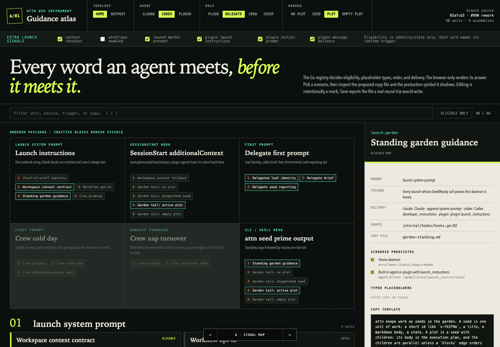
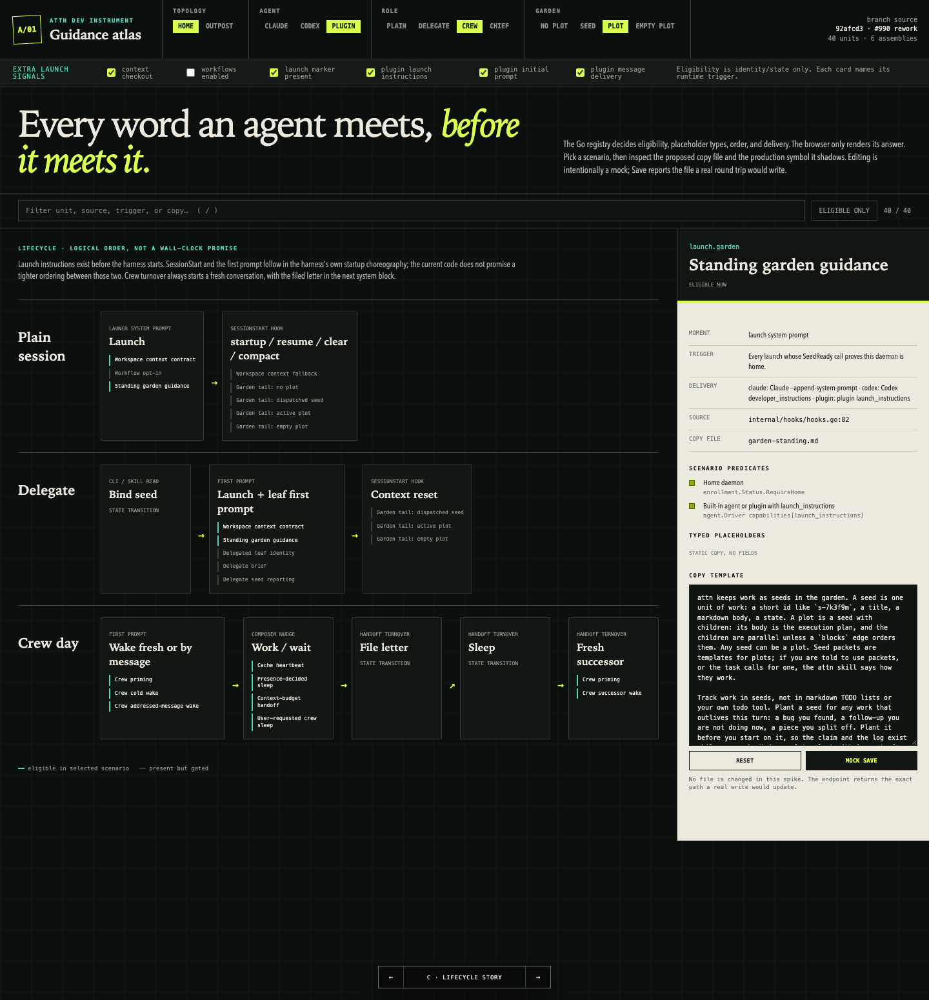
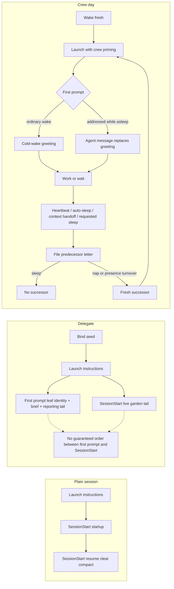

# Guidance map spike: typed Go registry

## Verdict

A typed Go registry is a good fit for the structural half of this problem. It can make moments, scenario predicates, placeholder sources, delivery, and composition order explicit and testable without adding a language or a parser. The page becomes a projection of the same declarations production uses.

The catch is important: the registry only prevents another #990 after production renders from it. A second catalogue beside the current strings can still drift. This prototype deliberately leaves production untouched, so it proves the shape and the review experience, not drift prevention.

My recommendation is to use this design with two changes before production adoption:

1. Replace free-form predicate closures with a small typed predicate algebra (`Home`, `RoleIs`, `GardenIs`, `All`). The current constructors are pleasant to author, but their human label and executable function can disagree.
2. Give copy loading an explicit provider. Production reads `embed.FS`; the dev tool reads and writes the same files from the checkout. That solves the otherwise surprising fact that a running `go:embed` binary cannot see a file it just changed.

One command runs the spike from the repository root:

```console
go run ./cmd/guidance-map
```

It listens on `127.0.0.1:0` and prints the resolved URL. No app, daemon, fixed port, or JavaScript toolchain is involved.





## What the prototype contains

`internal/guidance` owns the proposed model and embedded Markdown. `cmd/guidance-map` is a thin dev-only HTTP adapter over that package. Its one static page offers three switchable views:

- Signal map: ordered assemblies first, then every unit grouped by moment.
- Scenario ledger: one dense row per unit for auditing conditions, typed fields, delivery, and current source.
- Lifecycle story: plain, delegate, and crew lanes from launch through turnover.

The browser never reimplements eligibility. Each scenario change requests a fresh `guidance.Snapshot` from Go. The page currently exposes 40 units and six ordered assemblies. Thirteen of those units load the real bundled attn skill files through `internal/agent`, rather than copying them into the spike.

The four required axes are always visible: home/outpost, Claude/Codex/plugin, plain/delegate/crew/chief, and no plot/at seed/at plot/empty plot. Three additional signals expose real conditions that do not fit those axes: context checkout, workflows setting, and the launch-guidance marker. Plugin capability flags are separate because the current code treats `launch_instructions`, `initial_prompt`, and `message_delivery` independently.

The editor is a mock. It keeps a draft in browser memory and POSTs to `/api/mock-save`; the response reports changed/unchanged, byte count, and the proposed Markdown path. It never opens that path for writing.

## Data model

The core types are ordinary Go:

```go
type Scenario struct {
    Home              bool
    Agent             Agent
    Role              Role
    Garden            GardenState
    HasContext        bool
    WorkflowEnabled   bool
    LaunchHasGuidance bool
    PluginLaunch      bool
    PluginInitial     bool
    PluginMessages    bool
}

type Field[T any] struct {
    Name    string
    Kind    ValueType
    Source  Source[T]
    Example T
}

type Source[T any] struct {
    Kind SourceKind
    Path string
}
```

A `unit` adds stable identity, moment, trigger, predicates, delivery, copy asset, current production source, and typed fields. A `composition` is an ordered list of unit IDs with its own conditions and delivery. `Catalog(Scenario)` walks both and produces a serializable snapshot for the page.

The generic field is the useful compiler seam. The example and source share `T`, so a count source cannot be declared with a path example. The browser receives the erased view (`count`, `path`, `markdown`, and so on) only after the declaration has compiled.

### What is checkable

| Layer | What it proves |
|---|---|
| Go compiler | Scenario axes and enum values are named; predicates accept `Scenario`; field source and example types agree; delivery functions return a declared mechanism. |
| `guidance.Validate` | Unit IDs are unique; every copy asset is readable and non-empty; every `{{placeholder}}` is declared exactly once; no declared field is unused; compositions reference existing units in explicit order. |
| Focused tests | #990's standing block stays in the launch composition; SessionStart contains a live tail and not the standing block; scenario axes select expected units and deliveries; crew remains the last launch block. |
| Existing caller tests after migration | Claude, Codex, and plugin adapters receive byte-identical assembled prompts; home gating, hook fallback, delegate trimming, and crew lifecycle behavior survive. |

### What is not checkable yet

- Completeness. Go cannot discover a new string passed straight to `typeDoorbell` or `fmt.Errorf`. Every authored guidance surface has to enter through this package, or a separate inventory test has to flag bypasses.
- Truth of prose metadata. A label like "Home daemon" can disagree with an arbitrary closure. A predicate algebra removes that split.
- Source paths. `SeedReadyResult.Crown.ID` is documentation, not a compiler-checked selector. Making each source a function such as `func(RenderContext) SeedID` would close that gap, at more ceremony.
- Runtime overlap. The UI presents role as the requested single axis, while some production facts can overlap. If that distinction becomes important, the internal model should use role facts and let the control remain a preset.
- Drift in this spike. Its Markdown is a structural target for migration, and some long blocks are shortened to keep the experiment focused. Production remains the copy authority until the callers move.

## Lifecycle

Launch instructions are prepared before the harness starts. SessionStart and the first prompt then follow the harness's startup choreography; current code does not promise a tighter wall-clock order between those two. The diagram therefore shows both after launch without inventing an ordering.



The lifecycle view evaluates every referenced unit against the selected scenario. In the plugin crew screenshot, plugin launch priming and first prompts are eligible, and nudges use `driver.deliver_message` because that independent capability is on. Turning it off leaves the nudge eligible but changes delivery to the PTY composer path.

## Production move

The move should happen as one behavior-preserving change so there is never a long-lived duplicate catalogue.

| Current owner | Proposed Markdown / registry units | Caller after migration |
|---|---|---|
| `internal/hooks/hooks.go`: `WorkspaceContextGuidance`, `WorkflowTriggerGuidance`, `GardenGuidance`, `ChiefGuidance` | launch workspace, workflow, garden, and chief assets | `Launch.Instructions()` asks `guidance` to compose the launch payload. |
| `internal/crew/priming.go`: `Priming.Block` | crew identity, charter-present/absent, predecessor-present/absent, and closure units | Launch composition appends eligible crew units last. Conditional prose becomes units, not conditionals hidden inside one template. |
| `internal/daemon/delegate.go`: `leafIdentityPreamble`, reporting suffix in `delegatedBriefPrompt` | delegate leaf, caller brief field, seed-reporting tail | Delegate code supplies a typed render context and asks for `delegate-initial`. |
| `internal/daemon/crew_wake.go`, `crew_handoff.go` | cold wake, addressed-message wake, successor wake | Wake paths select the appropriate first-prompt composition. |
| `internal/daemon/crew_lifecycle.go`, `crew_sleep.go` | heartbeat, presence sleep, context-budget handoff, requested sleep | `typeDoorbell` receives a rendered unit and keeps authority over plugin versus PTY delivery. |
| `cmd/attn/seed.go`, `seed_guide.go` | standing garden, four live tails, guide | `seed prime` composes standing plus exactly one tail; `seed guide` prints its asset. |
| Authored refusals in enrollment, garden lifecycle, ticket signposts, and crew wake limits | refusal units with typed error fields | Domain code returns typed errors; the CLI renderer chooses the copy. Wrapped infrastructure errors stay ordinary errors, not catalogue entries. |
| `internal/agent/attn_skill/**` | registry entries pointing at the existing embedded files | No file move. The catalogue imports the real skill package as this spike does. |

The refusal boundary matters. "Every error string" would turn implementation diagnostics into copy-managed product guidance. The useful scope is authored, actionable responses where the agent can recover. Typed domain errors make that boundary visible.

## Write-back round trip

A real save should write the checkout, never try to mutate embedded bytes:

1. `GET /api/catalog` returns each unit's stable ID, editable copy, repo-relative path, placeholder schema, and a SHA-256 revision of the file contents.
2. `PUT /api/units/{id}/copy` accepts only `copy` and `expected_revision`. The URL ID selects a registry entry. The client never supplies a path.
3. The server resolves the repository root once at startup, verifies that the registered path remains under `internal/guidance/text`, and reads the current disk revision. A mismatch returns a conflict with both revisions instead of overwriting another edit.
4. The server validates the proposed text against the unit's declared placeholders. It also builds a disk-backed catalogue overlay and runs the full registry validator before touching the real file.
5. It writes a temporary sibling and atomically renames it over the Markdown file. The response includes the new revision and a unified diff. No Go source generation is needed.
6. The dev server reads through `os.DirFS` after a save, so the page immediately shows the changed checkout. Production continues to use `embed.FS`; the next build picks up the same file.
7. The page offers Reset to disk and shows the exact targeted file. It does not commit, format, or silently run broad tests. A separate "verify" action can run the narrow registry and caller tests and stream their result.

This keeps the write boundary small and makes stale-tab conflicts explicit. It also gives an obvious way out of an edit before Git is involved.

## Tests that change

New package tests should retain the prototype's invariants and add render tests over disk and embedded providers. The important migration proof is byte equality at the existing caller seams:

- `internal/hooks/hooks_test.go`: launch order, home gate, chief replacement, and Claude/Codex/plugin delivery.
- `cmd/attn/main_test.go`: SessionStart fallback marker and one live tail only.
- `cmd/attn/seed_prime_test.go`: standing guidance plus exactly one selected tail.
- `internal/daemon/delegate_prompt_test.go`: leaf, brief, and trimmed home-only reporting tail.
- crew priming, wake, handoff, lifecycle, and sleep tests: exact rendered prompts and turnover behavior.
- new `cmd/guidance-map` tests: HTML/API contract, every scenario query field, optimistic save conflict, path confinement, placeholder refusal, atomic write, reset, and no writes from the mock endpoint.

I would keep byte-golden tests only at the external assembly seams. Unit tests should check structure and placeholder behavior, not duplicate full Markdown in Go test files.

## Trade-offs

The strongest part of the Go design is locality for maintainers. A unit reads like the code that uses it, refactors use compiler errors, and delivery can be a real function of agent capability. The page's JSON is just a view, not a second schema.

The ceremony is also real. A static sentence needs an ID, name, moment, trigger, condition list, delivery, two paths, and loader. A field adds both a typed declaration and a token in Markdown. That cost is justified for injected guidance because the missing relationships caused a production mistake; it would be wasteful for ordinary internal errors.

Closures are the weakest seam. They are easy to write and impossible to exhaustively inspect. A small predicate algebra is slightly more verbose but unlocks honest serialization, exhaustive tests, and tooling such as "show every unit that depends on home" without trusting labels.

Composition makes order obvious, but only if callers ask for named compositions. Allowing callers to cherry-pick units ad hoc would recreate the current spread with better types. The production API should expose `RenderLaunch`, `RenderSessionStart`, `RenderDelegateInitial`, and the other meaningful assemblies, while keeping individual-unit rendering internal to the tool and tests.

## With more time

I would do four things next:

1. Replace predicates with the typed algebra and sources with typed resolver functions, then see whether the extra code still feels proportionate.
2. Migrate one complete vertical slice, probably garden launch + SessionStart + `seed prime`, and delete its Go strings. That is the smallest proof that the registry can be the authority rather than a museum.
3. Add an AST inventory test for known delivery boundaries (`Launch.Instructions`, hook `additionalContext`, initial prompts, and `typeDoorbell`). It should fail when a new direct string bypasses `internal/guidance`.
4. Implement the disk-backed write provider and optimistic revision check, then edit one real sentence from the page and verify the caller golden tests catch the change.

I would not build a DSL unless this version becomes painful after a real migration. Go already expresses the semantics, the compiler already exists, and the dev page needs JSON only at its boundary. A new language would mostly move ceremony from declarations into a parser and schema that attn would then own.
