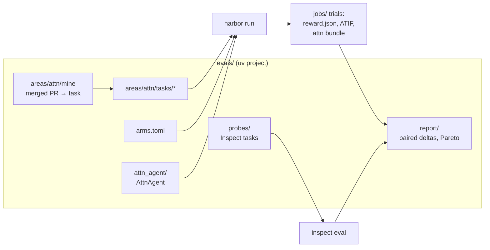
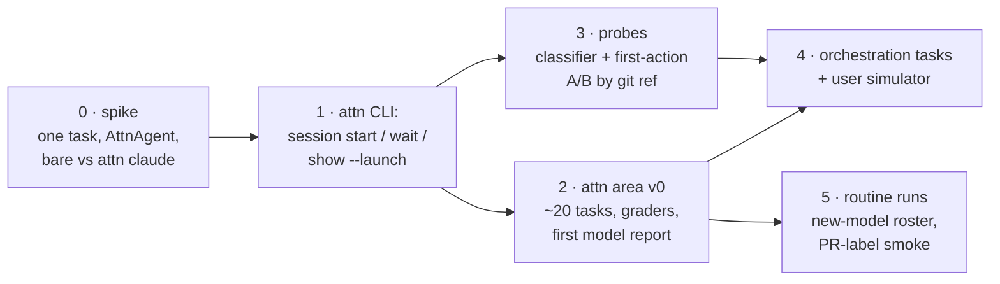

# Plan: agent evals

attn is used to build attn and other projects. This plan adds an eval suite
that answers two questions with numbers, not impressions:

1. **Which harness and model does my kind of work best?** Claude Code, Codex,
   Copilot and Pi across models and effort levels, on real work from real
   repositories. Building attn is the first area.
2. **Does attn's prompting make agents better?** attn injects launch
   guidance, delegation briefs, Garden instructions, crew priming, skills and
   helper-model prompts. Each change to that text should be measurable: better,
   worse, or noise.

We build on [Harbor](https://github.com/harbor-framework/harbor), the
framework Terminal-Bench now runs on. We don't write our own runner, container
layer, trajectory format or viewer. What attn adds is the part no framework has:
an agent adapter that is attn itself, tasks mined from attn's history, and
graders that know what Victor reviews for.

## Vocabulary

| term | meaning |
|---|---|
| **area** | a body of work tasks come from: one repository and its conventions. `attn` is the first. |
| **task** | one Harbor task directory: instruction, environment, hidden tests, reference solution. |
| **arm** | one configuration under test: harness × model × effort × attn build (a git ref, or `none` for the bare harness). |
| **trial** | one run of one task on one arm. Tasks run several trials per arm. |
| **probe** | a cheap, narrow check of one prompt: a single model call or an agent's first few actions, many samples. |

"Scenario" is avoided on purpose: it already names a test kind and
`internal/prompts/scenarios`.

## Why Harbor

The research that led here compared Harbor, Inspect AI, SWE-bench-style
miners, and promptfoo. Harbor wins on four things:

- **Harnesses attn already wraps are built in.** `claude-code`, `codex`,
  `copilot-cli` and `pi` ship as installed agents, so the bare-harness
  baseline arms come free.
- **A custom agent is a small Python class.** `BaseInstalledAgent` with
  `install`, `run`, `populate_context_post_run`, loaded with
  `--agent-import-path`. attn becomes an agent; the inner harness is a
  parameter (`--ak harness=codex`).
- **The task format fits.** `instruction.md`, `task.toml`,
  `environment/Dockerfile`, `tests/test.sh` writing `reward.json` with named
  scores. Multi-step tasks (`steps/step-N/`) model follow-up prompts.
  Reward Kit adds trajectory checks and LLM or agent judges.
- **Runs, statistics and viewer are done.** `--n-attempts`, `--n-concurrent`,
  pass@k, Docker locally or Daytona/Modal/E2B for parallelism, a viewer with
  a cost-versus-reward Pareto tab. Trajectories use ATIF.

Inspect AI is the fallback and the stats layer: `inspect_harbor` loads Harbor
tasks directly, and Inspect has better reducers (`pass_at_k`, clustered
stderr). It is also the better runner for probes: thousands of single-call
samples, no container per sample. Choosing Harbor for trials loses nothing.

## The shape



Three tiers, cheapest first:

| tier | question | unit | cost per sample | runner |
|---|---|---|---|---|
| probes | does this prompt make the model do the right first thing? | one call or first N actions | cents | Inspect |
| build tasks | which arm ships correct, house-style work? | full session to done | dollars | Harbor |
| orchestration tasks | does attn's meta-harness (plots, delegation, crew) pay off? | a session tree | several dollars | Harbor |

Probes are where prompt A/B gets statistical power. Full tasks are where
model comparison gets realism. A prompt change that probes favour gets
confirmed on a small task slice, not the other way round.

## Arms

An arm is a row in `evals/arms.toml`:

```toml
[arms.claude-opus-attn]
harness = "claude"
model = "claude-opus-5-5"
effort = "high"
attn = "next"            # git ref; built once per commit and cached

[arms.claude-opus-bare]
harness = "claude"
model = "claude-opus-5-5"
effort = "high"
attn = "none"            # Harbor's stock claude-code agent
```

- **Every attn arm has a bare twin.** The with/without delta is the
  meta-harness's value, per harness and per model. Without the twin, a model
  that is good despite attn's prompts looks like attn helping.
- **A prompt variant is a git ref.** A variant is a branch with prompt edits,
  usually from `prompt-editor` drafts. It needs no new runtime switch. It is
  reproducible, and it lines up with `prompt-editor compare --base <ref>`, so
  every A/B report can show the rendered-scenario diff next to the score delta.
  Every trial records `DefinitionsHash` from the catalog, so a result always
  names the exact prompt set it measured.
- **Delegation roles are arms too.** `attn delegate roles` maps pathfinder,
  builder, orchestrator and reviewer to models. The payoff of question 1 is
  evidence for those defaults.

## The attn adapter

`AttnAgent(BaseInstalledAgent)`, parameters `harness`, `model`, `effort`,
`attn_ref`:

1. **install**: put the Linux `attn` build for `attn_ref` and the pinned
   harness CLI into the container. Start the daemon with `ATTN_DATA_DIR`
   inside the trial's log directory, never a real `~/.attn`.
2. **run**: start a top-level session in the task repo with the instruction as
   its first prompt, the way Victor would. Wait until attn classifies it as
   waiting for the user. Multi-step tasks send the next step's instruction as
   the next prompt.
3. **populate_context_post_run**: collect an attn bundle, then convert the
   inner harness's own session files to ATIF with Harbor's existing
   converters. The bundle holds:
   - the transcript of every session in the tree (`attn session transcript --json`)
   - the session ledger rows and the cost ledger
   - `delegation_operations` and the parent graph
   - the Garden export
   - state traces
   - the rendered launch prompt with its trace and `DefinitionsHash`

   The last item matters because ATIF records neither system prompts nor tool
   definitions (Harbor issue #3333), and those are exactly what an attn prompt
   A/B changes.

The daemon owns the state an eval needs, so the Mac-only app is never in the
loop. Everything runs in Linux containers, the same daemon that already runs
on remote hosts.

### What attn has to grow

The adapter must only use attn's promises, so the gaps become CLI features
with wire or stack tests. Agents and automations want them too:

- **`attn session start`**: start a top-level session without a TTY: `--agent`,
  `--model`, `--effort`, `--cwd`, `--prompt-file`, `--yolo`, `--json`. The
  protocol already has add-session (`scripts/wsctl` uses it). The only CLI path
  today is the wrapper, which needs a terminal, or `attn delegate`, which
  primes the agent as a delegate, not as a session the user started.
- **`attn session wait <id> --for waiting|closed [--timeout]`**: block until
  the state changes, driven by `session.state.changed` on the bus. Without it
  the adapter would poll `attn agent peek`. The Chief waiting on delegations
  is a second caller.
- **`attn session show <id> --launch`**: the rendered launch instructions, the
  prompt trace and `DefinitionsHash` for a session. This is inspection that
  should exist anyway.

Everything else the bundle needs is already exposed by the CLI or the store.

## The attn area

### Where tasks come from

1. **Mined from merged PRs.** For each PR, check out its merge base, apply only
   the PR's test changes, and keep the tests that fail before and pass after:
   fail-to-pass. The rest of `make test` is the pass-to-pass regression set.
   `instruction.md` is written from the PR's title, body and linked seed, then
   edited by hand into what Victor would actually type. SWE-Factory and
   SWE-bench-Live automate this for arbitrary repos. attn's tests already
   report clean pass/fail, so a small script is enough, and it becomes the
   miner for later areas.
2. **Hand-authored.** Kinds of work PRs don't capture well:
   - diagnose before fixing: given a symptom and logs, propose instrumentation
   - a protocol change end to end (TypeSpec, generate, version bumps, daemon, app)
   - a prompt rewrite under `docs/prompt-authoring.md`
   - an idle-CPU regression hunt
   - a Linux-only daemon bug

attn's own testing rule makes mined tests unusually fair as hidden tests. A
committed test "depends only on promises, never on internals", so a correct
solution shaped differently from Victor's still passes. Curation still drops
PRs whose tests use harness helpers added in the same PR, unless those
helpers go into the task's starting state.

**Contamination.** attn is public. Prefer PRs merged after each model's
training cutoff and report results per cutoff bucket, as SWE-rebench does.
Hand-authored tasks are never pushed publicly.

### Graders

`tests/test.sh` writes a `reward.json` with separate scores. It never squashes
them into one number:

| score | how |
|---|---|
| `resolved` | fail-to-pass tests pass |
| `no_regressions` | pass-to-pass set passes (`make test`, `make test-frontend` where touched) |
| `lint` | `make lint`, which includes the two-line comment rule |
| `linux` | `cmd/attn` and `internal/**` cross-compile for linux/amd64 |
| `protocol` | when the schema changed: types regenerated, both version constants bumped |
| `review_*` | Reward Kit agent judge with a rubric drawn from `CLAUDE.md` Review and `docs/testing.md`: tests guard promises, no speculative fallbacks, comment rules, simplicity |

The headline is `resolved ∧ no_regressions`. The rest explain why arms
differ. Judge scores are calibrated against Victor. Every run, a sample of
diff pairs from different arms goes to him blind, as pairwise preference.
Judge-versus-Victor agreement is reported next to judge scores, and the rubric
is fixed until agreement is good enough.

### Environment

One base image, `attn-eval-base`:
- Go, Node/pnpm, Rust and `libghostty-vt` for linux/amd64 and linux/arm64,
  provisioned by the same script the Linux runner uses (`docs/linux-runner.md`)
- warmed Go module and pnpm stores
- pinned harness CLIs

Each task image adds the repo at its base commit. Trials run under Harbor's
Docker backend on a Linux box, or a remote backend when parallelism matters.
Model API hosts are the only outbound network a trial needs.

## Measuring attn's prompts

### Probes

Probes are cheap and narrow, and each one reuses something attn already has:

- **Helper-model prompts are classifiers. Score them as classifiers.**
  - The turn classifier (WAITING/DONE/PARKED) is what queue mode rests on.
  - Session titles, the ticket reconciler, the garden advisor.
  - The dataset is real inputs copied out of a production data dir (read-only,
    per the working rules), labeled once. The metric is accuracy, plus a
    confusion matrix for the classifier.
  - The prompt is rendered by the variant's own `attn prompts render --set`,
    so a probe always measures the catalog at that ref.
- **Launch and delegation prompts are scored by first actions.** Start from the
  saved inputs in `internal/prompts/scenarios/*.json`, render the prompt, and
  give the harness a short task. Then check its first N tool calls against the
  prompt's intent. Examples:
  - Does a delegate read its seed before working?
  - Does the Chief delegate instead of doing the work?
  - Does a crew member on wake read its handoff?

  Many samples per variant, graded by trajectory predicates. Where a predicate
  can't decide, a judge does.

### Orchestration tasks

These are full tasks built to reward the meta-harness:
- a feature large enough that planting a plot with `blocks` edges and
  delegating the pieces should beat doing it alone
- a review task that should be delegated to a reviewer role
- a crew handoff across a restart

LoopsBench's dependency-graph tasks map directly onto plots. DecisionBench's
metrics (routing fidelity, delegation rate, an oracle-routing ceiling) score
the delegation choices themselves.

### Attention cost

attn's product is the user's attention, so attention gets measured. A **user
simulator** stands in for Victor. It is a fixed model, the same for every arm,
and it holds the task's hidden `intent.md`. When a session enters "waiting for
you" before the work is done, the simulator answers the way Victor would, and
the adapter counts the interruption.

Each trial reports:
- **interruptions per resolved task**
- **attention-minutes**: the time the simulator's human would have spent
  reading and answering

A model that resolves 80% but asks twice per task may be worse for the queue
than one that resolves 75% and never asks. This is the one metric no public
benchmark reports, and the one that matches the product.

## Reporting

Every comparison is **paired**: the same tasks, several trials per arm.

- **Per arm:** resolved rate with a bootstrap CI; cost (from attn's cost ledger
  for attn arms, the harness's own usage for bare arms); wall time; turns;
  interruptions.
- **Per pair of arms:** the paired per-task delta with a CI. When it crosses
  zero the report says "no detectable difference", not a ranking.
- A Pareto view of resolved rate against cost, from Harbor's viewer.

**Rough power:** 20 tasks × 5 trials detects differences of about 15 points.
Suites grow before fine distinctions are claimed. That is also why prompt A/B
leans on probes.

## Cost control

- 5 trials × 4 harnesses × 2 variants × 20 tasks = 800 sessions, so the
  default slice is small.
- Full-roster runs happen on demand when a model ships. New prices landing in
  `internal/sessioncost/prices.go` is the usual signal.
- Prompt-changing PRs run the probes and a 5-task smoke slice on request (a PR
  label), never automatically on every push.
- Use API keys, not subscriptions: cost is attributable, parallel trials don't
  hit plan rate limits, and prices are comparable across harnesses. Copilot
  authenticates with a GitHub token either way.

## Where it lives

The adapter, miner, probes, arms and the attn area live in `evals/` in this
repo, as a uv project. They depend on attn's CLI and prompt catalog, and they
should change in the same PR as those. Later areas (other repositories Victor
builds) are separate Harbor datasets. They reuse the miner and the adapter,
and can live next to their own repos. Results never get committed. Harbor's
`jobs/` stays on the eval machine, and summaries go to wherever Victor wants to
read them.

## The arc



0. **Spike (not committed).** Run one hand-written task on bare `claude-code`
   and on a throwaway `AttnAgent` that drives the daemon over `wsctl`. This
   proves the container, auth and bundle path end to end. Victor decides what
   follows.
1. **The CLI additions**, with wire or stack tests, because they are CLI
   promises.
2. **attn area v0**: the miner, about 15 mined tasks and 5 hand-authored ones,
   the graders, 4–6 arms. The first report answers question 1.
3. **Probes**: the classifier dataset and first-action probes for the
   delegation, Chief and crew-wake prompts. Report integration with
   `prompt-editor compare`. This is the first real answer to question 2.
4. **Orchestration tasks and the user simulator**, which bring in attention
   cost.
5. **Routine runs**: the roster run when a model ships, and the PR-label smoke
   slice.

Stages 2 and 3 are independent after stage 1 and can run as parallel
delegations. Planted as a plot, the stages are its children and the arrows are
its `blocks` edges.

## Open decisions

- **The first arm roster.** Which models and effort levels are worth paying
  for on day one.
- **Eval machine.** A local Linux box through the Linux runner, or a remote
  Harbor backend (Daytona or Modal) for parallel trials.
- **The user simulator's model**, and whether hand-authored tasks stay out of
  the public repo.
- **How much of Victor's time goes to blind pairwise review** per run, which
  is what keeps the judge honest.
