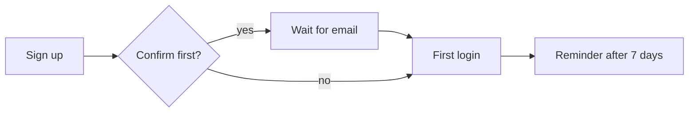

Signup can let people in before they confirm their email, or hold them until they do.

```mermaid
flowchart LR
  A[Sign up] --> B{Confirm first?}
  B -- yes --> C[Wait for email] --> D[First login]
  B -- no --> D --> E[Reminder after 7 days]
```

{{question}}
