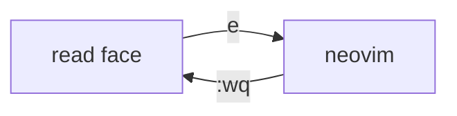

# The reader tour

This document exercises every block the reader knows. Prose is set in the **system font** with *emphasis*, `inline code`, ~~strikes~~, and a [link to this file](reader-tour.md) plus an [external one](https://example.com).

## Lists and tasks

- Plain bullets wrap when the line runs long enough to need a second line in a narrow tile, which this one does.
- [x] A finished task
- [ ] An open task
  - nested bullet under the task

1. First ordered item
2. Second, with `code`

> A quote: keyboard-first, but discoverable.

### A table

| key | what it does |
|-----|--------------|
| `e` | edit in place |
| `:wq` | save and go back to reading |

```rust
fn main() {
    println!("hello from a code block");
}
```

## A diagram



## A picture


---

The end.
